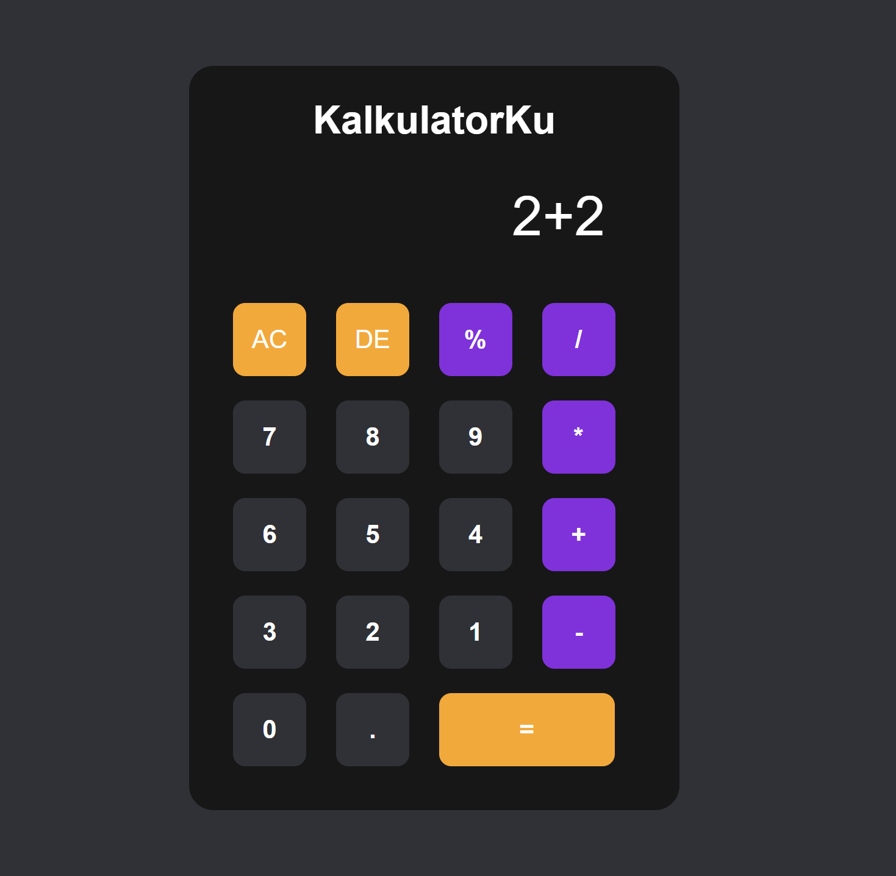

# Kalkulator

Repositori Kalkulator berisi implementasi kalkulator sederhana menggunakan HTML, CSS, dan JavaScript. Kalkulator ini memungkinkan pengguna untuk melakukan operasi aritmatika dasar seperti penambahan, pengurangan, perkalian, dan pembagian.

## Preview

## Fitur

- **Operasi Aritmatika Dasar**: Pengguna dapat melakukan penambahan, pengurangan, perkalian, dan pembagian menggunakan kalkulator ini.
  
- **Input Keyboard**: Kalkulator mendukung input dari keyboard sehingga pengguna dapat dengan mudah melakukan operasi menggunakan keyboard.

- **Riwayat Operasi**: Riwayat operasi ditampilkan di layar sehingga pengguna dapat melihat riwayat perhitungan mereka.

## Cara Menggunakan

1. Buka file `index.html` di peramban web Anda.

2. Gunakan tombol-tombol kalkulator untuk memasukkan angka dan melakukan operasi aritmatika.

3. Anda juga dapat menggunakan keyboard untuk memasukkan angka dan melakukan operasi. Tombol keyboard yang sesuai akan terhubung dengan tombol pada kalkulator.

## Kontribusi

Kami menyambut kontribusi dari para pengembang untuk meningkatkan kalkulator ini. Jika Anda memiliki saran atau ingin melaporkan masalah, silakan buka [issue](https://github.com/username/Kalkulator/issues) atau kirimkan [pull request](https://github.com/username/Kalkulator/pulls).

---

© 2024 Kalkulator. Dibuat dengan ❤️ oleh Tim Pengembang Kalkulator.
